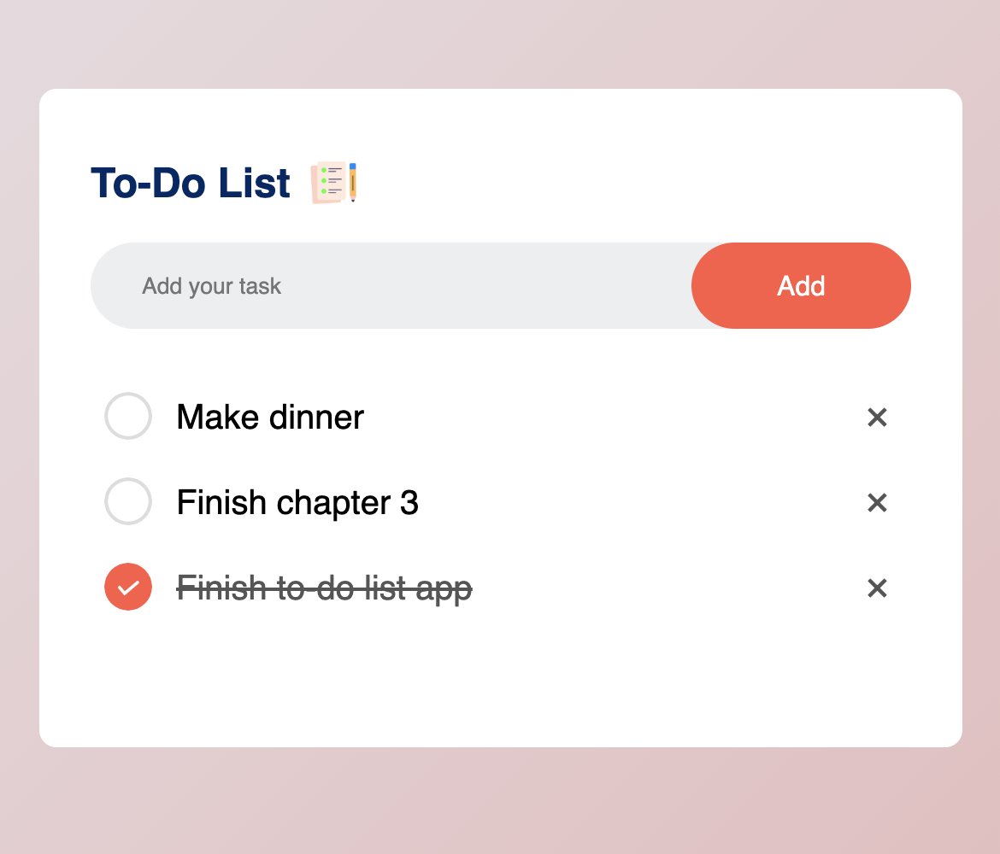

# To-Do List App

A simple To-do list app, basically the "Hello World!" of coding projects. Created to practise HTML, CSS and Javascript.

Tutorial used: [Task App In JavaScript](https://www.youtube.com/watch?v=G0jO8kUrg-I)

## Preview

## Technologies Used
- HTML, CSS, JavaScript
- A Github Repo(duh)
